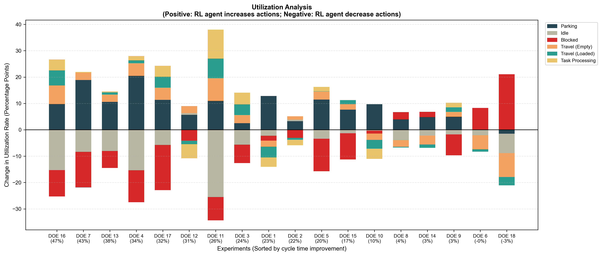
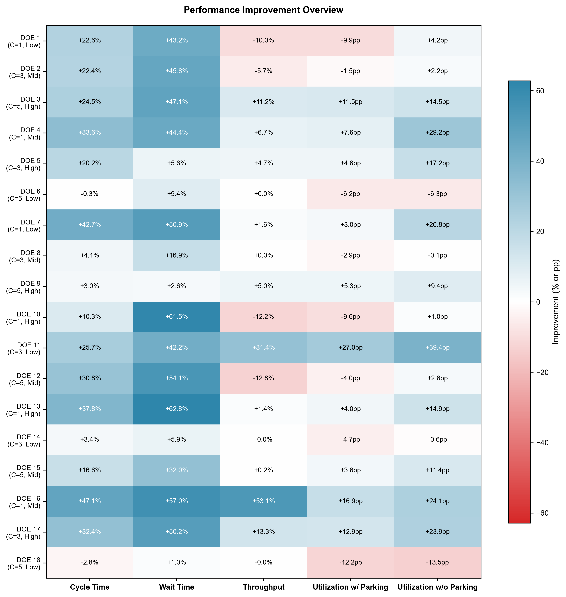
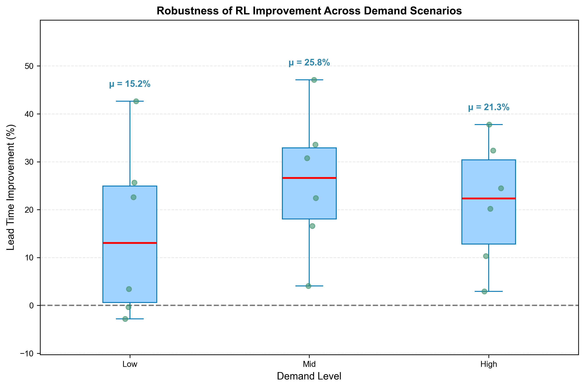
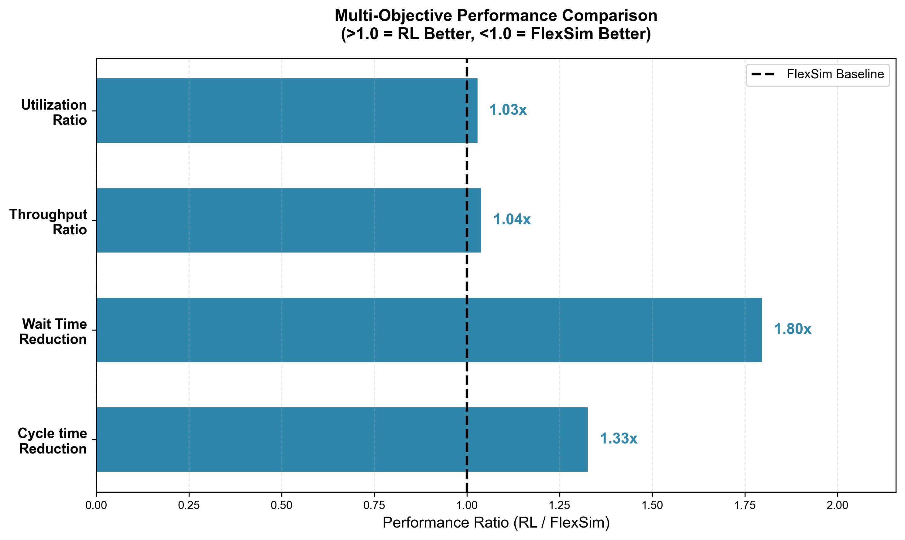

# HHRL-AGV-Dispatch

<p align="center">
  <strong>Dynamic Multi-Task Dispatching for AGV Control</strong><br/>
  From reactive dispatching to strategic orchestration for multi-load AGVs in AI server reliability testing.
</p>

<p align="center">
  
</p>

<p align="center">
  A direct visual reference to the conventional dispatching baseline used for comparison.<br/>
  Use the demo to quickly inspect how the traditional rule-based method behaves before comparing it with the proposed HHRL framework.
</p>

<p align="center">
  <a href="https://youtu.be/k7mr7pZXXjo">
    
  </a>
  <a href="#visual-snapshot">
    
  </a>
</p>

<p align="center">
  
  
  
</p>

<p align="center">
  Built for high-variability, disturbance-heavy production environments.<br/>
  Achieves up to <strong>24.71% lower cycle time</strong> and <strong>44.38% lower waiting time</strong> compared with rule-based baselines.
</p>

## Overview

This repository presents a hierarchical heuristic reinforcement learning framework for dynamic AGV dispatching in AI server reliability testing workshops. The method combines strategic task planning with real-time execution control, enabling multi-load AGVs to respond more effectively to disturbances, congestion, and shifting task priorities.

## Highlights

- Hierarchical dispatching that separates strategic planning from low-level execution
- D3QN-based high-level policy with invalid action masking
- Opportunistic picking and intent coordination for stronger AGV collaboration
- Significant improvements in cycle time and waiting time under dynamic disturbances

## Repository Contents

- `experiment-results/DOE*/sim`: simulation outputs for each DOE setting
- `experiment-results/DOE*/rl`: reinforcement learning outputs for each DOE setting
- `P/`: project figures, mechanism illustrations, and summary visualizations

## Visual Snapshot

| HHRL Mechanism | DOE Heatmap |
|---|---|
|  |  |

| Robustness | Radar Comparison |
|---|---|
|  |  |

## Citation

Citation details will be updated after the paper release.

```bibtex
@misc{hhrl_agv_dispatch_coming_soon,
  title   = {Dynamic Multi-Task Dispatching for AGV Control: A Hierarchical Heuristic Reinforcement Learning Approach with Opportunistic Picking Strategy in AI Server Reliability Testing Workshop},
  author  = {Chou, Che-Wei and Hsu, Yu-Teng and Chiou, Wei-Cheng and Ma, Kang-Ting},
  year    = {2026},
  note    = {Paper coming soon}
}
```

## Paper Status

The full manuscript and supplementary materials will be released soon.

## License

- Code and scripts: MIT License ([LICENSE](LICENSE))
- Experimental datasets and figures: CC BY 4.0 ([LICENSE-DATA](LICENSE-DATA))

## Authors

**Che-Wei Chou**, **Yu-Teng Hsu**, **Wei-Cheng Chiou**, **Kang-Ting Ma**

Department of Industrial Engineering and Systems Management, Feng Chia University, Taichung 407102, Taiwan, ROC  
Department of Business Administration and Graduate Institute of Logistics Management, National Dong Hwa University, Hualien, Taiwan, ROC

Primary contact: `cwchou@fcu.edu.tw`
